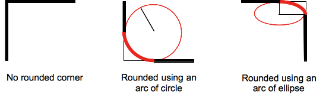
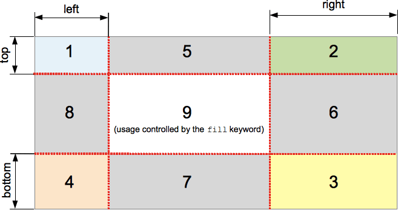

# 边框 Border

## 基本属性

### 边框宽度

▎**border-top-width**

▎**border-right-width**

▎**border-bottom-width**

▎**border-left-width**

▎**border-width** - 四个 `border-*-width` 属性的简写属性

```css
/* 初始值 medium */
/* 继承 no */
/* 适用于 所有属性，也适用于 ::first-letter */
.syntax {
  /* Keyword values */
  border-width: thin;
  border-width: medium;
  border-width: thick;

  /* <length> values */
  border-width: 4px;
  border-width: 1.2rem;

  /* vertical | horizontal */
  border-width: 2px 1.5em;
  /* top | horizontal | bottom */
  border-width: 1px 2em 1.5cm;
  /* top | right | bottom | left */
  border-width: 1px 2em 0 4rem;
}
```

### 边框样式

▎**border-top-style**

▎**border-right-style**

▎**border-bottom-style**

▎**border-left-style**

▎**border-style** - 四个 `border-*-style` 属性的简写属性

```css
/* 初始值 none */
/* 继承 no */
/* 适用于 所有属性，也适用于 ::first-letter */
.syntax {
  /* Keyword values */
  border-style: none;
  border-style: hidden;
  border-style: dotted;
  border-style: dashed;
  border-style: solid;
  border-style: double;
  border-style: groove;
  border-style: ridge;
  border-style: inset;
  border-style: outset;

  /* vertical | horizontal */
  border-style: dotted solid;
  /* top | horizontal | bottom */
  border-style: hidden double dashed;
  /* top | right | bottom | left */
  border-style: none solid dotted dashed;
}
```

### 边框颜色

▎**border-top-color**

▎**border-right-color**

▎**border-bottom-color**

▎**border-left-color**

▎**border-color** - 四个 `border-*-color` 属性的简写属性

```css
/* 初始值 currentcolor */
/* 继承 no */
/* 适用于 所有属性，也适用于 ::first-letter */
.syntax {
  /* <color> values */
  border-color: red;

  /* vertical | horizontal */
  border-color: red #f015ca;
  /* top | horizontal | bottom */
  border-color: red rgb(240, 30, 50, 0.7) green;
  /* top | right | bottom | left */
  border-color: red yellow green blue;
}
```

### 简写属性

▎**border-top** - 三个 `border-top-*` 属性的简写属性

▎**border-right** - 三个 `border-right-*` 属性的简写属性

▎**border-bottom** - 三个 `border-bottom-*` 属性的简写属性

▎**border-left** - 三个 `border-left-*` 属性的简写属性

```css
/* 初始值 medium none currentcolor */
/* 继承 no */
/* 适用于 所有属性，也适用于 ::first-letter */
.syntax {
  border-left: 1px;
  border-left: 2px dotted;
  border-left: medium dashed green;
}
```

▎**border** - 四个 `border-*` 属性的简写属性

```css
.syntax {
  /* style */
  border: solid;
  /* width | style */
  border: 2px dotted;
  /* style | color */
  border: outset #f33;
  /* width | style | color */
  border: medium dashed green;
}
```

### 圆角边框

▎**border-top-left-radius**

▎**border-top-right-radius**

▎**border-bottom-right-radius**

▎**border-bottom-left-radius**

▎**border-radius** - 四个 `border-*-*-radius` 属性的简写属性

```css
/* 初始值 0 */
/* 继承 no */
/* 百分比 相对于 border box 尺寸 */
/* 1つの半径を設定すると円の角になり、
2つの半径を設定すると楕円の角になります。*/
.syntax {
  /* radius is set for all 4 sides */
  border-radius: 10px;
  /* top-left-and-bottom-right | top-right-and-bottom-left */
  border-radius: 10px 5%;
  /* top-left | top-right-and-bottom-left | bottom-right */
  border-radius: 2px 4px 2px;
  /* top-left | top-right | bottom-right | bottom-left */
  border-radius: 1px 0 3px 4px;

  /* (first radius values) / radius */
  border-radius: 10px / 20px;
  /* (first radius values) / top-left-and-bottom-right | top-right-and-bottom-left */
  border-radius: 10px 5% / 20px 30px;
  /* (first radius values) / top-left | top-right-and-bottom-left | bottom-right */
  border-radius: 10px 5px 2em / 20px 25px 30%;
  /* (first radius values) / top-left | top-right | bottom-right | bottom-left */
  border-radius: 10px 5% / 20px 25em 30px 35em;
}
```



### 边框图片

▎**border-image-source** - 边框图片的路径

```css
/* 初始值 none */
/* 继承 no */
.syntax {
  /* Keyword value */
  border-image-source: none;

  /* <image> values */
  border-image-source: url(image.jpg);
  border-image-source: linear-gradient(to top, red, yellow);
}
```

▎**border-image-slice** - 怎么切割边框图片

分割 `border-image-source` 指定的图片为 9 个区域：四个角，四条边以及一个中间区域。

```css
/* 初始值 100% */
/* 继承 no */
/* 百分比 相对于 border image 的大小 */
.syntax {
  /* all sides */
  border-image-slice: 30%;
  /* vertical | horizontal */
  border-image-slice: 10% 30%;
  /* top | horizontal | bottom */
  border-image-slice: 30 30% 45;
  /* top | right | bottom | left */
  border-image-slice: 7 12 14 5;

  /* Using the `fill` keyword */
  /* fill 关键词若无，中间部分会被视为完全透明 */
  border-image-slice: 10% fill 7 12;
}
```



▎**border-image-width** - 元素的边框图片的宽度

```css
/* 初始值 1 */
/* 继承 no */
.syntax {
  /* Keyword value */
  /* auto - 图片切片本身的宽高 */
  border-image-width: auto;
  /* <length> value */
  border-image-width: 1rem;
  /* <percentage> value */
  border-image-width: 25%;
  /* <number> value */
  /* 相对于 border-width 的倍数 */
  border-image-width: 3;

  /* vertical | horizontal */
  border-image-width: 2em 3em;
  /* top | horizontal | bottom */
  border-image-width: 5% 15% 10%;
  /* top | right | bottom | left */
  border-image-width: 5% 2em 10% auto;
}
```

如果 `border-image-width` 属性值大于元素的 `border-width`，则边框图像将向内扩张。

▎**border-image-outset** - 边框图片区域超出边框的量

```css
/* 初始值 0 */
/* 继承 no */
.syntax {
  /* <length> value */
  border-image-outset: 1rem;

  /* <number> value */
  border-image-outset: 1.5;

  /* vertical | horizontal */
  border-image-outset: 1 1.2;
  /* top | horizontal | bottom */
  border-image-outset: 30px 2 45px;
  /* top | right | bottom | left */
  border-image-outset: 7px 12px 14px 5px;
}
```

▎**border-image-repeat** - 边框图片的覆盖方式

```css
/* 初始值 stretch */
/* 继承 no */
.syntax {
  /* Keyword value */
  /* 拉伸图像 */
  border-image-repeat: stretch;
  /* 平铺图像 */
  border-image-repeat: repeat;
  border-image-repeat: round;
  border-image-repeat: space;

  /* vertical | horizontal */
  border-image-repeat: round stretch;
}
```

▎**border-image** - `border-image-*` 的简写属性

```css
.syntax {
  /* source | slice */
  border-image: linear-gradient(red, blue) 27;
  /* source | slice | repeat */
  border-image: url('/images/border.png') 27 space;
  /* source | slice | width */
  border-image: linear-gradient(red, blue) 27 / 35px;
  /* source | slice | width | outset | repeat */
  border-image: url('/images/border.png') 27 23 / 50px 30px / 1rem round space;
}
```

### 阴影效果

▎**box-shadow** - 以逗号分隔列表来描述一个或多个阴影效果

```css
/* 初始值 none */
/* 继承 no */
/* 适用于 所有元素，也适用于 ::first-letter */
.syntax {
  /* Keyword values */
  box-shadow: none;

  /* offset-x | offset-y | color */
  box-shadow: 60px -16px teal;
  /* offset-x | offset-y | blur-radius | color */
  box-shadow: 10px 5px 5px black;
  /* offset-x | offset-y | blur-radius | spread-radius | color */
  box-shadow: 2px 2px 2px 1px rgba(0, 0, 0, 0.2);

  /* inset | offset-x | offset-y | color */
  box-shadow: inset 5em 1em gold;

  /* Any number of shadows, separated by commas */
  box-shadow: 3px 3px red, -1em 0 0.4em olive;
}
```

## 边框合并

▎**border-collapse** - 表格的单元格边框是否合并

```css
/* 初始值 separate */
/* 继承 yes */
/* 适用于 table 和 inline-table 元素 */
 {
  /* Keyword values */
  border-collapse: collapse;
  border-collapse: separate;
}
```

## 参考

- [CSS Backgrounds and Borders - CSS: Cascading Style Sheets | MDN](https://developer.mozilla.org/en-US/docs/Web/CSS/CSS_Backgrounds_and_Borders)
