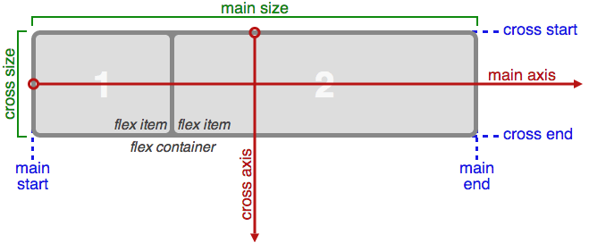
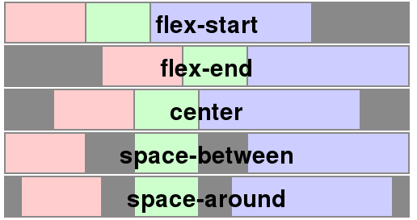
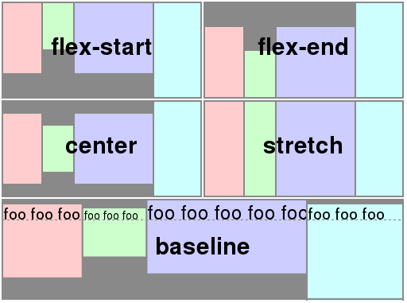
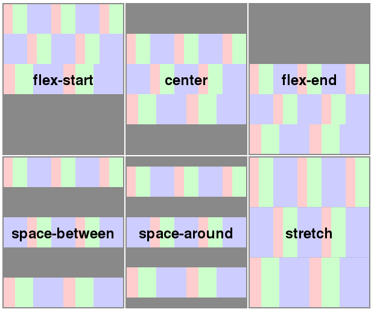

# Flexible Box Layout



```css
/* 定义一个 flex 容器 */
.container {
  display: flex; /* or inline-flex */
}
```

## Flex 容器属性

▎**flex-direction** - flex 容器的主轴方向

```css
/* 初始值 row */
/* 继承 no */
/* 适用于 flex 容器 */
.syntax {
  /* The direction text is laid out in a line */
  flex-direction: row;
  /* Like <row>, but reversed */
  flex-direction: row-reverse;
  /* The direction in which lines of text are stacked */
  flex-direction: column;
  /* Like <column>, but reversed */
  flex-direction: column-reverse;
}
```

▎**flex-wrap**

```css
/* 初始值 nowrap */
/* 继承 no */
/* 适用于 flex 容器 */
.syntax {
  /* 单行 */
  flex-wrap: nowrap;
  /* 多行 */
  flex-wrap: wrap;
  /* 同 wrap 但侧轴方向相反 */
  flex-wrap: wrap-reverse;
}
```

▎**flex-flow** - `flex-direction` 和 `flex-wrap` 的简写形式

```css
/* 继承 no */
/* 适用于 flex 容器 */
.syntax {
  /* flex-flow: <'flex-direction'> */
  flex-flow: row;
  flex-flow: row-reverse;
  flex-flow: column;
  flex-flow: column-reverse;

  /* flex-flow: <'flex-wrap'> */
  flex-flow: nowrap;
  flex-flow: wrap;
  flex-flow: wrap-reverse;

  /* flex-flow: <'flex-direction'> and <'flex-wrap'> */
  flex-flow: row nowrap;
  flex-flow: column wrap;
  flex-flow: column-reverse wrap-reverse;
}
```

▎**justify-content** - 项目在主轴上的对齐方式

```css
/* 初始值 normal */
/* 继承 no */
/* 适用于 flex 容器 */
.syntax {
  /* Positional alignment */
  justify-content: center;
  justify-content: flex-start;
  justify-content: flex-end;

  /* Normal alignment */
  justify-content: normal;

  /* Distributed alignment */
  justify-content: space-between;
  justify-content: space-around;
}
```



▎**align-items** - 项目在侧轴上的对齐方式。默认值 `stretch`

```css
/* 初始值 normal */
/* 继承 no */
/* 适用于 flex 容器 */
.syntax {
  /* Basic keywords */
  align-items: normal;
  align-items: stretch;

  /* Positional alignment */
  align-items: center;
  align-items: flex-start;
  align-items: flex-end;

  /* Baseline alignment */
  align-items: baseline;
}
```



▎**align-content** - 单行容器无效

```css
/* 初始值 normal */
/* 继承 no */
/* 适用于 多行 flex 容器 */
.syntax {
  /* Basic positional alignment */
  align-content: center;
  align-content: flex-start;
  align-content: flex-end;

  /* Normal alignment */
  align-content: normal;

  /* Distributed alignment */
  align-content: space-between;
  align-content: space-around;
  align-content: stretch;
}
```



## Flex 项目属性

▎**order** - 项目的排列顺序，数值越小，排列越靠前

```css
/* 初始值 0 */
/* 继承 no */
.syntax {
  /* <integer> values */
  order: 5;
  order: -5;
}
```

▎**align-self** - 允许单个项目有与其他项目不一样的侧轴对齐方式，可覆盖 `align-items` 属性

```css
/* 初始值 auto */
/* 继承 no */
.syntax {
  /* Keyword values */
  /* 继承父元素的 align-items 属性 */
  align-self: auto;
}
```

▎**flex-grow** - 项目的放大比例

```css
/* 初始值 0，即如果存在剩余空间，项目也不放大 */
/* 继承 no */
.syntax {
  /* <number> values */
  flex-grow: 3;
  flex-grow: 0.6;
}
```

> 如果所有项目的 `flex-grow` 属性值都为 1，则它们将等分剩余空间。如果其中某个项目的 `flex-grow` 属性值为 2，则其占据的剩余空间将比其他项目多一倍。

▎**flex-shrink** - 项目的缩小比例

```css
/* 初始值 1，即如果容器空间不足，项目将缩小 */
/* 继承 no */
.syntax {
  /* <number> values */
  flex-shrink: 2;
  flex-shrink: 0.6;
}
```

> 如果所有项目的 `flex-shrink` 属性值都为 1，当空间不足时，它们将等比例缩小。如果其中某个项目的 `flex-shrink` 属性值为 0，则其不缩小。

▎**flex-basis** - 项目的初始大小

```css
/* 初始值 auto */
/* 继承 no */
.syntax {
  /* Specify <'width'> */
  flex-basis: 10em;
  flex-basis: 3px;
  flex-basis: auto;
}
```

> 当一个元素同时被设置了 `flex-basis`（非 `auto`）和 `width`（或者在 `flex-direction: column` 情况下设置了`height`）， `flex-basis` 具有更高的优先级

▎**flex** - `flex-grow` `flex-shrink` 和 `flex-basis` 的简写形式

```css
.syntax {
  /* Keyword values */
  flex: auto; /* = 1 1 auto */
  flex: initial;
  flex: none; /* = 0 0 auto */

  /* One value, unitless number: flex-grow */
  flex: 2;
  /* One value, width/height: flex-basis */
  flex: 10em;
  flex: 30%;

  /* Two values: flex-grow | flex-basis */
  flex: 1 30px;
  /* Two values: flex-grow | flex-shrink */
  flex: 2 2;

  /* Three values: flex-grow | flex-shrink | flex-basis */
  flex: 2 2 10%;
}
```

## 相关文档

- [几张 GIF 动图让你看懂弹性盒模型如何工作](https://llp0574.github.io/2017/02/10/an-animated-guide-to-flexbox/)
- [CSS Flexible Box Layout - CSS: Cascading Style Sheets | MDN](https://developer.mozilla.org/en-US/docs/Web/CSS/CSS_Flexible_Box_Layout)
