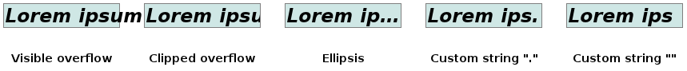

# 用户界面

▎**box-sizing**

```css
/* 初始值 content-box */
/* 继承 no */
/* 适用于 接受 width 或 height 的所有元素 */
.syntax {
  /* 标准模式盒模型 */
  /* width 和 height（以及 min/max-* 属性）
  仅包括 content */
  box-sizing: content-box;
  /* 怪异模式盒模型（quirks mode） */
  /* width 和 height（以及 min/max-* 属性）
  包括 content、padding 和 border */
  box-sizing: border-box;
}
```

▎**cursor** - 鼠标指针悬浮在元素上方显示的鼠标光标

```css
/* 初始值 auto */
/* 继承 yes */
/* 适用于 所有元素 */
.syntax {
  /* Keyword value */
  cursor: pointer;
  cursor: auto;

  /* URL, with a keyword fallback */
  /* <url> - 以防某些指针图片类型不被支持 */
  cursor: url(hand.cur), pointer;
}
```

▎**text-overflow**

```css
/* 初始值 clip */
/* 继承 no */
/* 适用于 块容器元素 */
.syntax {
  /* 裁剪溢出块容器的内容 */
  text-overflow: clip;
  /* 替换溢出块容器的内容为 '…' */
  text-overflow: ellipsis;
}
```

需要 `white-space` 和 `overflow` 属性配合使用

```css
p {
  white-space: nowrap;
  overflow: hidden; /* overflow 非 visible */
}
```



▎**resize** - 是否用户可以调整元素大小

```css
/* 初始值 none */
/* 继承 no */
.syntax {
  resize: none;
  resize: both;
  resize: horizontal;
  resize: vertical;
}
```

`resize` 属性不适用于 inline 元素和 `overflow` 属性为 `visible` 的 block 元素

## 轮廓

▎**outline-width** - 轮廓宽度

```css
/* 初始值 medium */
/* 继承 no */
/* 适用于 所有元素 */
.syntax {
  /* Keyword values */
  /* 细轮廓 */
  outline-width: thin;
  /* 中等的轮廓 */
  outline-width: medium;
  /* 粗轮廓 */
  outline-width: thick;

  /* <length> values */
  outline-width: 1px;
  outline-width: 0.1em;
}
```

轮廓是绘制于元素周围的一条线，位于 border 的外围

轮廓不占用空间

▎**outline-style** - 轮廓样式

```css
/* 初始值 none */
/* 继承 no */
/* 适用于 所有元素 */
.syntax {
  /* Keyword values */
  outline-style: auto;
  /* 无轮廓 */
  outline-style: none;
  /* 点状轮廓 */
  outline-style: dotted;
  /* 虚线轮廓 */
  outline-style: dashed;
  /* 实线轮廓 */
  outline-style: solid;
  /* 双线轮廓，outline-width 为两条线及其之间的距离的总和 */
  outline-style: double;
  /* 3D 凹槽轮廓 */
  outline-style: groove;
  /* 3D 凸槽轮廓 */
  outline-style: ridge;
  /* 3D 凹边轮廓 */
  outline-style: inset;
  /* 3D 凸边轮廓 */
  outline-style: outset;
}
```

▎**outline-color** - 轮廓颜色

```css
/* 初始值 invert（浏览器支持该值）或 currentColor */
/* 继承 no */
/* 适用于 所有元素 */
.syntax {
  /* <color> values */
  outline-color: #f92525;
  outline-color: rgb(30, 222, 121);
  outline-color: blue;

  /* Keyword value */
  /* 执行颜色反转（逆向的颜色）
  可使轮廓在不同的背景颜色中都是可见 */
  outline-color: invert;
}
```

▎**outline** - `outline-color` `outline-style` 和 `outline-width` 的简写形式

```css
/* 继承 no */
/* 适用于 所有元素 */
.syntax {
  /* style */
  outline: solid;
  /* color | style */
  outline: #f66 dashed;
  /* style | width */
  outline: inset thick;
  /* color | style | width */
  outline: green solid 3px;
}
```

▎**outline-offset** - 轮廓与元素的边缘或边框之间的空间量

```css
/* 初始值 0 */
/* 继承 no */
/* 适用于 所有元素 */
.syntax {
  /* <length> values */
  outline-offset: 3px;
  outline-offset: 0.2em;
}
```

## 参考

- [CSS Basic User Interface - CSS: Cascading Style Sheets | MDN](https://developer.mozilla.org/en-US/docs/Web/CSS/CSS_Basic_User_Interface)
