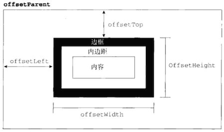
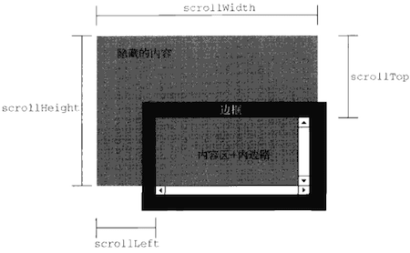

# Element

Element 类型用于表示 XML 或 HTML 元素，提供了对元素标签名、子节点及特性的访问。

## API 文档

---

<p align="center">HTMLElement ➠ Element ➠ Node ➠ EventTarget</p>

---

### 元素信息

▎Element.**tagName** - _readonly_ - 元素标签名

在 HTML 中，标签名始终都以全部大写表示。

▎Element.**id** - 元素在文档中的唯一标识符

```html
<span id="born">When I was born...</span>
```

```js
var span = document.getElementById('born')
console.log(span.tagName) // SPAN
console.log(span.id) // born
```

▎Element.**className** - 与元素的 `class` 特性对应

> 没有将这个属性命名为 `class`，是因为 `class` 是 ECMAScript 的保留字。

▎HTMLElement.**title** - 鼠标悬停在元素上时弹出框中显示的文本

```html
<div id="myDiv" class="bd" title="Body text"></div>
```

```js
var div = document.getElementById('myDiv')
console.log(div.tagName) // DIV
console.log(div.id) // myDiv
console.log(div.className) // bd
console.log(div.title) // Body text
```

▎Element.**classList** - _readonly_ - DOMTokenList

```js
// 添加 class
div.classList.add('foo')
div.classList.add('foo', 'bar')

// 移除 class
div.classList.remove('foo')
div.classList.remove('foo', 'bar')

// 切换 class
div.classList.toggle('foo')

// 是否包含指定 class
div.classList.contains('foo')
```

### 特性操作

▎Element.**attributes** - _readonly_ - NamedNodeMap

▎Element.**getAttribute** - 获取指定特性值

```ts
element.getAttribute(qualifiedName: DOMString): DOMString | null
```

▎Element.**setAttribute** - 添加一个新属性或修改指定特性值

```ts
element.setAttribute(qualifiedName: DOMString, value: DOMString): void
```

▎Element.**removeAttribute** - 移除指定特性

```ts
element.removeAttribute(qualifiedName: DOMString): void
```

▎Element.**hasAttribute** - 是否有指定特性

```ts
element.hasAttribute(qualifiedName: DOMString): boolean
```

▎Element.**getAttributeNames** - sequence\<DOMString\>

```ts
element.getAttributeNames(): sequence<DOMString>
```

### 查找元素

▎Element.**getElementsByTagName**

```ts
element.getElementsByTagName(qualifiedName: DOMString): HTMLCollection
```

▎Element.**getElementsByClassName**

```ts
element.getElementsByClassName(classNames: DOMString): HTMLCollection
```

▎Element.**querySelector**

```ts
element.querySelector(selectors: DOMString): Element | null
```

▎Element.**querySelectorAll**

```ts
element.querySelectorAll(selectors: DOMString): NodeList
```

### 元素遍历

▎Element.**children** - _readonly_ - HTMLCollection

▎Element.**childElementCount** - _readonly_ - 返回子元素的个数（不包括文本节点和注释）

▎Element.**firstElementChild** - _readonly_ - Element | null - 指向第一个子元素，`firstChild` 的元素版

▎Element.**lastElementChild** - _readonly_ - Element | null - 指向最后一个子元素，`lastChild` 的元素版

▎Element.**previousElementSibling** - _readonly_ - Element | null - 指向前一个同辈元素，`previousSibling` 的元素版

▎Element.**nextElementSibling** - _readonly_ - Element | null - 指向后一个同辈元素，`nextSibling` 的元素版

### 插入标记

虽然 DOM 为操作节点提供了细致入微的控制手段，但在需要给文档插入大量新 HTML 标记的情况下，通过 DOM 操作仍然非常麻烦，因为不仅要创建一系列 DOM 节点，而且还要小心地按照正确的顺序把它们连接起来。

相对而言，使用插入标记的技术，直接插入 HTML 字符串不仅更简单，速度也更快。

▎Element.**innerHTML** - 在读模式下，返回与调用元素的所有子节点（包括元素、注释和文本节点）对应的 HTML 标记。在写模式下，会根据指定的值创建新的 DOM 树，然后用这个 DOM 树完全替换调用元素原先的所有子节点。

▎Element.**outerHTML** - 在读模式下，返回调用它的元素及所有子节点的 HTML 标签。在写模式下，会根据指定的 HTML 字符串创建新的 DOM 子树，然后用这个 DOM 子树完全替换调用元素。

```js
// HTML:
// <div id="d"><p>Content</p><p>Further Elaborated</p></div>

d = document.getElementById('d')
console.log(d.outerHTML)
// <div id="d"><p>Content</p><p>Further Elaborated</p></div>
```

▎Element.**insertAdjacentHTML** - 将指定的文本解析为 HTML 或 XML，并将结果节点插入到 DOM 树中的指定位置

```ts
element.insertAdjacentHTML(position: DOMString, text: DOMString): void

// @参数 position
// 插入位置
// beforebegin | 在当前元素之前插入一个紧邻的同辈元素
//  afterbegin | 在当前元素第一个子元素之前插入
//   beforeend | 在当前元素最后一个子元素之后插入
//    afterend | 在当前元素之后插入一个紧邻的同辈元素

// @参数 text
// 要插入的 HTML 文本
```

```js
// 作为前一个同辈元素插入
element.insertAdjacentHTML('beforebegin', '<p>Hello world!</p>')
// 作为第一个子元素插入
element.insertAdjacentHTML('afterbegin', '<p>Hello world!</p>')
// 作为最后一个子元素插入
element.insertAdjacentHTML('beforeend', '<p>Hello world!</p>')
// 作为最后一个同辈元素插入
element.insertAdjacentHTML('afterend', '<p>Hello world!</p>')
```

```js
// <div id="one">one</div>
var d1 = document.getElementById('one')
d1.insertAdjacentHTML('afterend', '<div id="two">two</div>')

// At this point, the new structure is:
// <div id="one">one</div><div id="two">two</div>
```

### 页面滚动

▎Element.**scrollIntoView** - 通过滚动浏览器窗口或某个容器元素，让调用元素出现在视口中

```ts
element.scrollIntoView(alignToTop: boolean = true): void

// @参数 alignToTop
// 为 true 时，窗口滚动之后会让调用元素的顶部与视口顶部尽可能平齐
// 为 false 时，调用元素会尽可能全部出现在视口中，\
// 可能的话，调用元素的底部会与视口底部平齐
```
```js
// 让元素可见
document.forms[0].scrollIntoView()
```

当页面发生变化时，一般会调用这个方法来吸引用户的注意力。实际上，为某个元素设置焦点也会导致浏览器滚动并显示出获得焦点的元素。

### 访问元素样式

▎HTMLElement.**style** - _readonly_ - CSSStyleDeclaration - 元素的内联样式信息

```js
// Set multiple styles in a single statement
elt.style.cssText = 'color: blue; border: 1px solid black'
// Or
elt.setAttribute('style', 'color:red; border: 1px solid blue;')

// Set specific style while leaving other inline style values untouched
elt.style.color = 'blue'
```

### 元素偏移量

▎ HTMLElement.**offsetParent** - _readonly_ - Element | null

▎ HTMLElement.**offsetTop** - _readonly_ - 相对于 `offsetParent` 的水平偏移

▎ HTMLElement.**offsetLeft** - _readonly_ - 相对于 `offsetParent` 的垂直偏移

▎ HTMLElement.**offsetWidth** - _readonly_ - 元素占用宽度，包括 `padding`、`border` 和 `scrollbar`，不包括 `margin`

▎ HTMLElement.**offsetHeight** - _readonly_ - 元素占用高度，包括 `padding`、`border` 和 `scrollbar`，不包括 `margin`



```js
function getElementLeft(element) {
  var actualLeft = element.offsetLeft
  var current = element.offsetParent

  while (current !== null) {
    actualLeft += current.offsetLeft
    current = current.offsetParent
  }

  return actualLeft
}
```

### 客户区大小

▎Element.**clientTop** - _readonly_ - 元素顶部 border 宽度，包括 scrollbar

▎Element.**clientLeft** - _readonly_ - 元素左侧 border 宽度，包括 scrollbar

▎Element.**clientWidth** - _readonly_ - 元素内容展示部分宽度，包括 padding，但不包括 border、margin 和 scrollbar

▎Element.**clientHeight** - _readonly_ - 元素内容展示部分高度，包括 padding，但不包括 border、margin 和 scrollbar


### 滚动大小

▎Element.**scrollTop** - 元素内容垂直滚动的像素值

▎Element.**scrollLeft** - 元素内容水平滚动的像素值

▎Element.**scrollWidth** - _readonly_ - 元素内容区域实际宽度，包括 padding，但不包括 border、margin 和 scrollbar

▎Element.**scrollHeight** - _readonly_ - 元素内容区域实际高度，包括 padding，但不包括 border、margin 和 scrollbar



```js
window.pageXOffset ||
  document.body.scrollLeft ||
  document.documentElement.scrollLeft ||
  0
window.pageYOffset ||
  document.body.scrollTop ||
  document.documentElement.scrollTop ||
  0
```

### 确定元素大小

▎Element.**getBoundingClientRect**

```ts
element.getBoundingClientRect(): DOMRect

interface DOMRect {
  readonly x: double
  readonly y: double
  readonly width: double
  readonly height: double
}
```

## DOMTokenList

DOMTokenList 表示一组以空格分隔的 token。该集合可由 `Element.classList` 属性返回。

▎DOMTokenList.**length** - _readonly_

▎DOMTokenList.**item**

```ts
tokenlist.item(index)
tokenlist[index]
```

▎DOMTokenList.**contains** - 列表中是否存在给定的值

```ts
tokenlist.contains(token: DOMString): boolean
```

▎DOMTokenList.**add** - 将给定的字符串值添加到列表中。如果值已经存在，就不添加了

```ts
tokenlist.add(...tokens: DOMString): void
```

▎DOMTokenList.**remove** - 从列表中删除给定的字符串

```ts
tokenlist.remove(...tokens: DOMString): void
```

▎DOMTokenList.**toggle** - 如果列表中已经存在给定的值，删除它；如果列表中没有给定的值，添加它

```ts
tokenlist.toggle(token: DOMString, force?: boolean): boolean

// @参数 force
// 若为 true，则添加 token (等同 add())
// 若为 false，则删除 token (等同 remove())

// @返回值
// 若 token 在调用后的列表中存在，则返回 true，否则返回 false
```

▎DOMTokenList.**replace**

```ts
tokenlist.replace(token: DOMString, newToken: DOMString): boolean
```

## NamedNodeMap

NamedNodeMap 表示 Attr 对象的集合。与 NodeList 不同，NamedNodeMap 内部的对象没有特定的顺序，尽管它们可以像数组一样由索引访问。

NamedNodeMap 集合是“动态的”，每当文档结构发生变化时，集合内容会得到更新。

NamedNodeMap 不处理 Node 对象，而是用来处理 Attr 对象。

▎NamedNodeMap.**length** - _readonly_

▎NamedNodeMap.**item**

```ts
// getter
attrs.item(index: unsigned long): Attr | null
```

▎NamedNodeMap.**getNamedItem**

```ts
// getter
attrs.getNamedItem(qualifiedName: DOMString): Attr | null
```

▎NamedNodeMap.**setNamedItem**

```ts
attrs.setNamedItem(attr: Attr): Attr | null
```

▎NamedNodeMap.**removeNamedItem**

```ts
attrs.removeNamedItem(qualifiedName: DOMString): Attr
```

## CSSStyleDeclaration

CSSStyleDeclaration 对象可以使用三种 API 暴露

- 通过 `HTMLElement.style` 处理单个元素的内联样式
- 通过 `CSSStyleSheet`，例如

  ```js
  document.styleSheets[0].cssRules[0].style
  ```

- 通过 `Window.getComputedStyle()` - 获取元素上所有 CSS 属性和值

  ```js
  window.getComputedStyle(
    elt: Element,
    pseudoElt?: CSSOMString | null
  ): CSSStyleDeclaration
  ```

▎CSSStyleDeclaration.**cssText**

▎CSSStyleDeclaration.**length** - _readonly_

```js
// 设置多个样式属性
element.style.cssText = 'color: blue'
element.setAttribute('style', 'color: blue')

// 直接设置样式属性
element.style.color = 'blue'
element.style.borderBottom = '2px solid red'
```

## 参考

- [Element - Web APIs | MDN](https://developer.mozilla.org/en-US/docs/Web/API/Element)
- [HTMLElement - Web APIs | MDN](https://developer.mozilla.org/en-US/docs/Web/API/HTMLElement)
- [DOMTokenList - Web APIs | MDN](https://developer.mozilla.org/en-US/docs/Web/API/DOMTokenList)
- [NamedNodeMap - Web APIs | MDN](https://developer.mozilla.org/en-US/docs/Web/API/NamedNodeMap)
- [CSSStyleDeclaration - Web APIs | MDN](https://developer.mozilla.org/en-US/docs/Web/API/CSSStyleDeclaration)
