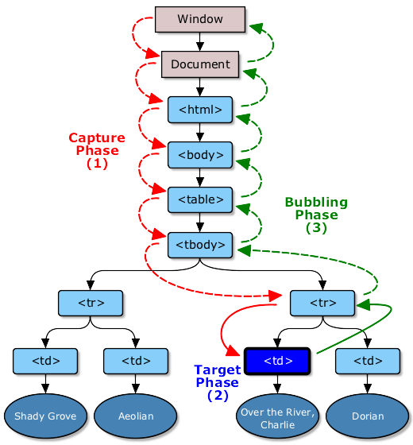

# DOM 事件流

DOM 事件流包括三个阶段：事件捕获阶段（Capture Phase）、处于目标阶段（Target Phase）和事件冒泡阶段（Bubble Phase）。

首先发生的是事件捕获，为截获事件提供了机会。然后是实际的目标接收到事件。最后一个阶段是冒泡阶段，可以在这个阶段对事件做出响应。

- 捕获阶段 - 事件对象从 window 经过目标的祖先元素传播到目标的父元素
- 目标阶段 - 事件对象到达它的事件目标（`target` 属性的值）
- 冒泡阶段 - 事件对象从目标的父元素开始，反向经过目标的祖先元素，到 window 结束
