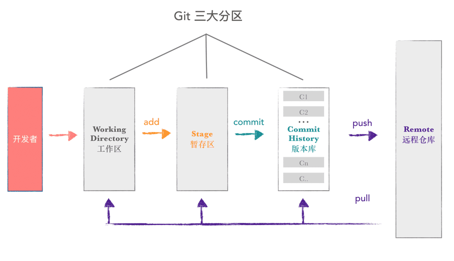

# Git 基本操作

- 版本创建
- 版本回退
- 工作区和暂存区
- 管理修改
- 撤销修改
- 对比文件不同
- 删除文件
- 基本操作小结

## 1. 版本创建

### 1.1. 创建一个版本库

新建一个目录 git_test

```sh
$ mkdir git_test

$ cd git_test/

$ ls -al
total 0
drwxr-xr-x   2 ryugaku  staff   64  7 29 01:25 .
drwx------+ 22 ryugaku  staff  704  7 29 01:25 ..
```

使用 **`git init`** 命令，在 git_test 目录下创建一个版本库

```sh
# git init
# 在当前目录新建一个 Git 代码库

$ git init
Initialized empty Git repository in /Users/ryugaku/Desktop/git_test/.git/

$ ls -al
total 0
drwxr-xr-x   3 ryugaku  staff   96  7 29 01:26 .
drwx------+ 22 ryugaku  staff  704  7 29 01:25 ..
drwxr-xr-x   9 ryugaku  staff  288  7 29 01:26 .git
```

可以看到在 git_test 目录下创建了一个 `.git` 隐藏目录，这就是 **版本库** 目录。

### 1.2. 版本创建

在 git_test 目录下新建一个文件 code.txt

```sh
$ touch code.txt

$ vi code.txt

$ cat code.txt
this is the first line
```

使用 **`git add`** 和 **`git commit`** 命令，创建一个版本

```sh
# 1. git add [file1] [file2] ...
# 添加指定文件到暂存区
# 2. git add [dir]
# 添加指定目录到暂存区, 包括子目录
# 3. git add .
# 添加当前目录的所有文件到暂存区

$ git add code.txt

# 4. git commit -m [message]
# 提交暂存区到仓库区
# 5. git commit [file1] [file2] ... -m [message]
# 提交暂存区的指定文件到仓库区

$ git commit -m '版本1'
[master (root-commit) a7f10de] 版本1
 1 file changed, 1 insertion(+)
 create mode 100644 code.txt
```

使用 **`git log`** 命令，查看版本记录

```sh
# git log
# 显示当前分支的版本历史

$ git log
commit a7f10de9e94e87de6d8985175a49f4c545191791 (HEAD -> master)
Author: ryugaku <251131698@qq.com>
Date:   Mon Jul 29 01:33:53 2019 +0800

    版本1
```

继续编辑 code.txt，在文件尾部添加一行内容

```sh
$ vi code.txt

$ cat code.txt
this is the first line
this is the second line  # NEW*
```

创建一个新版本，并查看版本记录

```sh
$ git add code.txt

$ git commit -m '版本2'
[master 820eb89] 版本2
 1 file changed, 1 insertion(+)

$ git log
commit 820eb898ede4235c4e17d61adbdf759d5c38703a (HEAD -> master)
Author: ryugaku <251131698@qq.com>
Date:   Mon Jul 29 01:39:08 2019 +0800

    版本2

commit a7f10de9e94e87de6d8985175a49f4c545191791
Author: ryugaku <251131698@qq.com>
Date:   Mon Jul 29 01:33:53 2019 +0800

    版本1
```

## 2. 版本回退

使用 **`git reset --hard`** 命令，将当前的版本 2 回退到前一个版本 1

```sh
# HEAD   表示当前最新版本
# HEAD^  表示当前版本的前一个版本
# HEAD^^ 表示当前版本的前前一个版本

# git reset --hard [commit]
# 重置当前分支的 HEAD 为指定 commit,
# 同时重置暂存区和工作区, 与指定 commit 一致

$ git reset --hard HEAD^
HEAD is now at a7f10de 版本1

$ cat code.txt
this is the first line

$ git log
commit a7f10de9e94e87de6d8985175a49f4c545191791 (HEAD -> master)
Author: ryugaku <251131698@qq.com>
Date:   Mon Jul 29 01:33:53 2019 +0800

    版本1
```

使用 `git reset --hard` 命令，再次回到版本 2

```sh
$ git reset --hard 820eb89  # commit_id 可以不写全
HEAD is now at 820eb89 版本2

$ cat code.txt
this is the first line
this is the second line
```

如果不知道版本 2 的 commit_id，可使用 **`git reflog`** 命令查看操作记录

```sh
# git reflog
# 显示当前分支的最近几次提交

$ git reflog  # 查看操作记录
820eb89 (HEAD -> master) HEAD@{0}: reset: moving to 820eb89
a7f10de HEAD@{1}: reset: moving to HEAD^
820eb89 (HEAD -> master) HEAD@{2}: commit: 版本2
a7f10de HEAD@{3}: commit (initial): 版本1
```

## 3. 工作区和暂存区

### 3.1. 工作区 Working Directory

就是你在电脑里能看到的目录，比如我们的 `git_test` 就是一个工作区。

### 3.2. 版本库 Repository

工作区有一个隐藏目录 `.git`，这个不算工作区，而是 Git 的版本库。

Git 的版本库里存了很多东西，其中最重要的就是称为 stage（或者叫 index）的 **暂存区**，还有 Git 为我们自动创建的第一个分支 `master`，以及指向 `master` 的一个指针叫 `HEAD`。


因为创建 Git 版本库时，Git 自动为我们创建了唯一一个 `master` 分支，所以现在 `git commit` 就是往 `master` 分支上提交更改。

可以简单理解为，需要提交的文件修改全放到暂存区，然后一次性提交暂存区的所有修改。



把文件往 Git 版本库里添加分两步执行

- 使用 `git add` 把文件修改添加到暂存区
- 使用 `git commit` 把暂存区的所有内容提交到当前分支

### 3.3. 工作区及暂存区中的文件状态

❶ 在 git_test 目录下在新建一个文件 code2.txt

```sh
$ touch code2.txt

$ vi code2.txt

$ cat code2.txt
the code2 first line  # NEW*
```

❷ 再次编辑 code.txt，在文件尾部添加一行内容

```sh
$ vi code.txt

$ cat code.txt
this is the first line
this is the second line
this is the third line  # NEW*
```

❸ 使用 **`git status`** 命令查看当前工作区的状态

```sh
# git status
# 显示有变更的文件

$ git status
On branch master  # 位于分支 master
Changes not staged for commit:  # 尚未暂存已备提交的变更
  (use "git add <file>..." to update what will be committed)
  # 使用 git add <文件>... 更新要提交的内容
  (use "git checkout -- <file>..." to discard changes in working directory)
  # 使用 git checkout -- <文件>... 丢弃工作区的改动

	modified:   code.txt

Untracked files:  # 未跟踪的文件
  (use "git add <file>..." to include in what will be committed)
  # 使用 git add <文件>... 以包含要提交的内容

	code2.txt

no changes added to commit (use "git add" and/or "git commit -a")
# 修改尚未加入提交 (使用 git add 和/或 git commit -a)
```

上面信息提示我们 code.txt 已被修改，以及 code2.txt 未被跟踪。

❹ 现在把 code.txt 和 code2.txt 加入到暂存区，然后再次使用 `git status` 命令

```sh
# $ git add code.txt
# $ git add code2.txt
# 或
$ git add code.txt code2.txt

$ git status
On branch master  # 位于分支 master
Changes to be committed:  # 要提交的变更
  (use "git reset HEAD <file>..." to unstage)
  # 使用 git reset HEAD <文件>... 以取消暂存

	modified:   code.txt   # 修改
	new file:   code2.txt  # 新文件

```

❺ 使用 `git commit` 命令就可以一次性把暂存区的所有修改提交到分支，创建一个版本。

```sh
$ git commit -m '版本3'
[master def28d0] 版本3
 2 files changed, 2 insertions(+)
 create mode 100644 code2.txt

$ git log
commit def28d07d8559c4a0b3b89715f1bc2704a6b606e (HEAD -> master)
Author: ryugaku <251131698@qq.com>
Date:   Mon Jul 29 13:53:22 2019 +0800

    版本3

commit 820eb898ede4235c4e17d61adbdf759d5c38703a
Author: ryugaku <251131698@qq.com>
Date:   Mon Jul 29 01:39:08 2019 +0800

    版本2

commit a7f10de9e94e87de6d8985175a49f4c545191791
Author: ryugaku <251131698@qq.com>
Date:   Mon Jul 29 01:33:53 2019 +0800

    版本1
```

❻ 一旦提交完成后，如果没有对工作区做任何修改，那么工作区就是“干净”的。

```sh
$ git status
On branch master  # 位于分支 master
nothing to commit, working tree clean
# 无文件要提交, 干净的工作区
```

## 4. 管理修改

Git 只会提交暂存区的修改来创建版本。

❶ 编辑 code.txt，在文件尾部添加一行内容，并使用 `git add` 命令将文件添加到暂存区中

```sh
$ vi code.txt

$ cat code.txt
this is the first line
this is the second line
this is the third line
this is the forth line  # NEW*

$ git add code.txt
```

❷ 继续编辑 code.txt，在文件尾部添加一行内容

```sh
$ vi code.txt

$ cat code.txt
this is the first line
this is the second line
this is the third line
this is the forth line
this is the new line  # NEW*
```

❸ 使用 `git commit` 命令创建一个新版本，然后使用 `git status` 命令

```sh
$ git commit -m '版本4'
[master b58de4e] 版本4
 1 file changed, 1 insertion(+)

$ git status
On branch master  # 位于分支 master
Changes not staged for commit:  # 尚未暂存以备提交的变更
  (use "git add <file>..." to update what will be committed)
  # 使用 git add <文件>... 更新要提交的内容
  (use "git checkout -- <file>..." to discard changes in working directory)
  # 使用 git checkout -- <文件>... 丢弃工作区的改动

	modified:   code.txt  # 修改

no changes added to commit (use "git add" and/or "git commit -a")
# 修改尚未加入提交 (使用 git add 和/或 git commit -a)
```

## 5. 撤销修改

❶ 使用 **`git checkout -- <文件>...`** 命令丢弃工作区的改动

```sh
$ git checkout -- code.txt

$ cat code.txt
this is the first line
this is the second line
this is the third line
this is the forth line
# this is the new line  <- 最后一行内容消失

$ git status
On branch master  # 位于分支 master
nothing to commit, working tree clean
# 无文件要提交, 干净的工作区
```

❷ 继续编辑 code.txt，在文件尾部添加一行内容，然后使用 `git status` 命令

```sh
$ vi code.txt

$ cat code.txt
this is the first line
this is the second line
this is the third line
this is the forth line
this is the new line  # NEW*

$ git status
On branch master  # 位于分支 master
Changes not staged for commit:  # 尚未暂存以备提交的变更
  (use "git add <file>..." to update what will be committed)
  # 使用 git add <文件>... 更新要提交的内容
  (use "git checkout -- <file>..." to discard changes in working directory)
  # 使用 git checkout -- <文件>... 丢弃工作区的改动

	modified:   code.txt  # 修改

no changes added to commit (use "git add" and/or "git commit -a")
# 修改尚未加入提交 (使用 git add 和/或 git commit -a)
```

❸ 将修改后的文件添加到暂存区，然后使用 `git status` 命令

```sh
$ git add code.txt

$ git status
On branch master  # 位于分支 master
Changes to be committed:  # 要提交的变更
  (use "git reset HEAD <file>..." to unstage)
  # 使用 git reset HEAD <文件>... 以取消暂存

	modified:   code.txt  # 修改

```

**`git reset HEAD <文件>...`** 命令可以把暂存区的修改撤销掉，重新放回工作区

```sh
$ git reset HEAD code.txt
Unstaged changes after reset:  # 重置后取消暂存的变更
M	code.txt

$ git status
On branch master  # 位于分支 master
Changes not staged for commit:  # 尚未暂存以备提交的变更
  (use "git add <file>..." to update what will be committed)
  # 使用 git add <文件>... 更新要提交的内容
  (use "git checkout -- <file>..." to discard changes in working directory)
  # 使用 git checkout -- <文件>... 丢弃工作区的改动

	modified:   code.txt  # 修改

no changes added to commit (use "git add" and/or "git commit -a")
# 修改尚未加入提交 (使用 git add 和/或 git commit -a)
```

❹ 假若想丢弃 code.txt 的修改，可使用 `git checkout -- <文件>...` 命令

```sh
$ git checkout -- code.txt

$ cat code.txt
this is the first line
this is the second line
this is the third line
this is the forth line
# this is the new line  <- 最后一行内容消失

$ git status
On branch master
nothing to commit, working tree clean
```

如果改乱了文件，还从暂存区提交到了版本库，则需要进行版本回退。

### 5.1. 小结

- 改乱了工作区中某个文件的内容，想直接丢弃工作区的修改。使用 `git checkout -- <文件>...` 命令。
- 不仅改乱了工作区中某个文件的内容，还将其添加到了暂存区，想丢弃修改。先使用 `git reset HEAD <文件>...` 命令回到上一例场景，再按照上一例场景操作。
- 当已提交了不合适的修改到版本库时，想要撤销本次提交。使用版本回退。

## 6. 对比文件的不同

### 6.1. 对比工作区和某个版本中文件的不同

❶ 编辑 code.txt，在文件尾部添加一行内容

```sh
$ vi code.txt

$ cat code.txt
this is the first line
this is the second line
this is the third line
this is the forth line
this is the new line  # NEW*
```

❷ 对比工作区中的 code.txt 和 HEAD 版本中的 code.txt 的不同

```sh
$ git diff HEAD -- code.txt
diff --git a/code.txt b/code.txt
index 66f9219..cb0957a 100644
--- a/code.txt  # - 代表 HEAD 版本中 code.txt 的内容
+++ b/code.txt  # + 代表工作区中 code.txt 的内容
@@ -2,3 +2,4 @@ this is the first line
 this is the second line
 this is the third line
 this is the forth line
+this is the new line  # 工作区的 code.txt 比 HEAD 版本的多了一行
```

❸ 丢弃工作区的改动

```sh
$ git checkout -- code.txt

$ git status
On branch master
nothing to commit, working tree clean
```

### 6.2. 对比两个版本间文件的不同

对比 HEAD 和 HEAD^ 版本中 code.txt 的不同

```sh
$ git diff HEAD HEAD^ -- code.txt
diff --git a/code.txt b/code.txt
index 66f9219..01e1274 100644
--- a/code.txt
+++ b/code.txt
@@ -1,4 +1,3 @@
 this is the first line
 this is the second line
 this is the third line
-this is the forth line

$ git diff HEAD^ HEAD -- code.txt
diff --git a/code.txt b/code.txt
index 01e1274..66f9219 100644
--- a/code.txt
+++ b/code.txt
@@ -1,3 +1,4 @@
 this is the first line
 this is the second line
 this is the third line
+this is the forth line
```

## 7. 删除文件

❶ 删除 code2.txt 文件，然后使用 `git status` 命令

```sh
$ rm code2.txt

$ git status
On branch master  # 位于分支 master
Changes not staged for commit:  # 尚未暂存以备提交的变更
  (use "git add/rm <file>..." to update what will be committed)
  # 使用 git add/rm <文件>... 更新要提交的内容
  (use "git checkout -- <file>..." to discard changes in working directory)
  # 使用 git checkout -- <文件>... 丢弃工作区的改动

	deleted:    code2.txt  # 删除

no changes added to commit (use "git add" and/or "git commit -a")
# 修改尚未加入提交 (使用 git add 和/或 git commit -a)
```

❷ 这时候有两种选择

第一种情况是确实要从版本库中删除该文件。使用 `git rm` 命令将删除的修改放入暂存区，然后在使用 `git commit` 创建一个新的版本记录。

```sh
$ git rm code2.txt
rm 'code2.txt'

$ git status
On branch master  # 位于分支 master
Changes to be committed:  # 要提交的变更
  (use "git reset HEAD <file>..." to unstage)
  # 使用 git reset HEAD <文件>... 以取消暂存

	deleted:    code2.txt  # 删除


$ git commit -m '删除 code2.txt'
[master 16b64ca] 删除 code2.txt
 1 file changed, 1 deletion(-)
 delete mode 100644 code2.txt

$ git log --pretty=oneline
16b64ca7c780722256075ba26b7008a4fcf0a78c (HEAD -> master) 删除 code2.txt
b58de4e1a8ff25f7158f51604c376c0e96c6a11e 版本4
def28d07d8559c4a0b3b89715f1bc2704a6b606e 版本3
820eb898ede4235c4e17d61adbdf759d5c38703a 版本2
a7f10de9e94e87de6d8985175a49f4c545191791 版本1
```

第二种情况是文件误删。直接使用 `git checkout -- code2.txt` 丢弃工作区的改动。

## 8. 基本操作小结

### 8.1. 创建版本仓库

- `git init`

### 8.2. 版本创建

- `git add 文件/目录`
- `git commit -m '版本说明信息'`

### 8.3. 查看版本记录

- `git log`

### 8.4. 版本回退

- `git reset --hard HEAD^`
- `git reset --hard 版本序列号`

### 8.5. 查看操作记录

- `git reflog`

### 8.6. 工作区、版本库和暂存区

- 编辑的文件都在工作区
- `git add` 把工作区的修改放入暂存区
- `git commit` 把暂存区的修改一次性做一次版本记录

### 8.7. 管理修改

`git commit` 只会把暂存区的修改提交到版本记录中

### 8.8. 撤销修改

- 直接丢弃工作区的改动
  - `git checkout -- 文件` 丢弃工作区的改动
- 修改已经加到暂存区，但还未提交
  1. `git reset HEAD 文件` 把暂存区的修改撤销掉，重新放回工作区
  2. `git checkout -- 文件`
- 已经提交
  - 版本回退

### 8.9. 对比文件的不同

- 对比工作区和版本库某个文件
  - `git diff HEAD -- 文件`
- 对比两个版本中的文件
  - `git diff HEAD HEAD^ -- 文件`

### 8.10. 删除文件

1. `rm 文件`
2. `git rm 文件`
3. `git commit`
