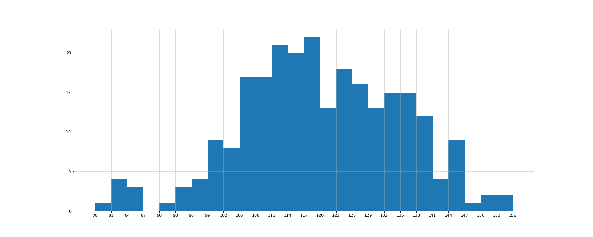

# Matplotlib

Matplotlib 是最流行的 Python 底层绘图库，主要做数据可视化图表。

```sh
$ pip3 install matplotlib
```

## 1. 折线图

### 1.1. 基础绘图

假设一天中每隔两个小时的气温如下列表，要求绘制折线图观察气温的变化情况。

```py
[15, 13, 14.5, 17, 20, 25, 26, 26, 27, 22, 18, 15]
```

```py
import matplotlib.pyplot as plt

if __name__ == '__main__':
    # x 坐标 (可迭代对象)
    x = range(2, 26, 2)
    # y 坐标 (可迭代对象)
    y = [15, 13, 14.5, 17, 20, 25, 26, 26, 27, 22, 18, 15]

    # x 轴和 y 轴的数据一起组成了所有要绘制出的坐标
    # 分别是 (2, 15), (4, 13), (6, 14.5), ...

    # 绘制图形
    plt.plot(x, y)
    # 显示图形
    plt.show()
```

### 1.2. 设置图形大小

```py
import matplotlib.pyplot as plt

if __name__ == '__main__':
    x = range(2, 26, 2)
    y = [15, 13, 14.5, 17, 20, 25, 26, 26, 27, 22, 18, 15]

    # 设置图形大小
    plt.figure(figsize=(20, 8), dpi=80)
    # 参数:
    # figsize 表示图形的大小
    # dpi 表示图形每英寸点数

    plt.plot(x, y)

    # 保存图形
    plt.savefig('./figure.png')
    # 可以保存为 SVG 矢量图格式, 放大不会有锯齿

    plt.show()
```

### 1.3. 调整 x 或 y 轴上的刻度

```py
import matplotlib.pyplot as plt

if __name__ == '__main__':
    x = range(2, 26, 2)
    y = [15, 13, 14.5, 17, 20, 25, 26, 26, 27, 22, 18, 15]

    plt.figure(figsize=(10, 5))
    plt.plot(x, y)

    # 设置 x 轴刻度
    # plt.xticks(x)
    plt.xticks(x[::2])  # 若刻度太密集, 可使用列表的步长

    # 设置 y 轴刻度
    plt.yticks(range(min(y), max(y) + 1))

    plt.show()
```

### 1.4. 自定义图形风格

```py
import matplotlib.pyplot as plt

if __name__ == '__main__':
    x = range(2, 26, 2)
    y = [15, 13, 14.5, 17, 20, 25, 26, 26, 27, 22, 18, 15]

    plt.figure(figsize=(10, 5))

    # 自定义图形的风格
    plt.plot(x, y, color='red', linestyle='-', linewidth=2, marker='o', alpha=0.5)
    # 参数:
    # color 线条颜色, 简写为 c
    # =========================
    # | 'b' | blue
    # | 'g' | green
    # | 'r' | red
    # | 'c' | cyan 蓝绿
    # | 'm' | magenta 洋红
    # | 'y' | yellow
    # | 'k' | black
    # | 'w' | white
    # =========================
    # linestyle 线条类型, 简写为 ls
    # =========================
    # | '-'  | 实线 solid
    # | '--' | 虚线 dashed
    # | '-.' | 虚点线 dash-dot
    # | ':'  | 点线 dotted
    # =========================
    # linewidth 线条粗细, 简写为 lw
    # marker 标注 (点的形状)
    # =========================
    # | '.'  | 点
    # | ','  | 像素
    # | 'o'  | 圆圈
    # | 'v'  | 下三角
    # | '^'  | 上三角
    # | '<'  | 左三角
    # | '>'  | 右三角
    # | '1'  | 下三叉
    # | '2'  | 上三叉
    # | '3'  | 左三叉
    # | '4'  | 右三叉
    # | 's'  | 正方形
    # | 'p'  | 五边形
    # | '\*' | 星号
    # | 'h'  | 六边形 1
    # | 'H'  | 六边形 2
    # | '+'  | 加号
    # | 'x'  | X
    # | 'D'  | 菱形
    # | 'd'  | 小菱形
    # | '\_' | 水平线
    # | '|'  | 垂直线
    # =========================
    # fmt 格式化字符串 '[marker][line][color]'
    # 如 'or' 红色圆圈, '-g' 绿色实线, '^k:' 黑色上三角点线
    # alpha 表示透明度

    plt.show()
```

### 1.5. 设置中文显示

假设如下列表表示 10 点到 12 点每分钟的气温，要求绘制折线图观察每分钟气温的变化情况。

```py
[random.randint(20, 35) for i in range(120)]
```

```py
import matplotlib.pyplot as plt
import random
from matplotlib import font_manager

if __name__ == '__main__':
    # 设置中文字体
    font = font_manager.FontProperties(fname='/System/Library/Fonts/PingFang.ttc')

    x = range(0, 120)
    y = [random.randint(20, 35) for i in range(120)]

    plt.figure(figsize=(20, 8), dpi=80)
    plt.plot(x, y)

    xtick_labels = [f'10点{i}分' for i in range(60)]
    xtick_labels += [f'11点{i}分' for i in range(60)]

    plt.xticks(ticks=list(x)[::3], labels=xtick_labels[::3], rotation=45, fontproperties=font)
    # 参数:
    # rotation 表示旋转的度数
    # fontproperties 在有中文输出的地方添加该属性

    plt.show()
```

### 1.6. 添加描述信息

```py
import matplotlib.pyplot as plt
import random
from matplotlib import font_manager

if __name__ == '__main__':
    font = font_manager.FontProperties(fname='/System/Library/Fonts/PingFang.ttc')

    x = range(0, 120)
    y = [random.randint(20, 35) for i in range(120)]

    plt.figure(figsize=(20, 8), dpi=80)
    plt.plot(x, y)

    xtick_labels = [f'10点{i}分' for i in range(60)]
    xtick_labels += [f'11点{i}分' for i in range(60)]
    plt.xticks(ticks=list(x)[::3], labels=xtick_labels[::3], rotation=45, fontproperties=font)

    # 添加描述信息
    plt.xlabel(xlabel='时间', fontproperties=font)
    plt.ylabel(ylabel='温度 单位(℃)', fontproperties=font)
    plt.title(label='10 点到 12 点每分钟的气温变化情况', fontproperties=font)

    plt.show()
```

### 1.7. 绘制网格

假设统计出了你从 11 岁到 30 岁每年交女友的数量情况。要求绘制折线图分析每年的女友数量走势，其中 x 轴表示岁数，y 轴表示个数。

```py
from matplotlib import pyplot as plt
from matplotlib import font_manager

if __name__ == '__main__':
    font = font_manager.FontProperties(fname='/System/Library/Fonts/PingFang.ttc')

    x = range(11, 31)
    y = [1, 0, 1, 1, 2, 4, 3, 2, 3, 4, 4, 5, 6, 5, 4, 3, 3, 1, 1, 1]

    plt.figure(figsize=(20, 8), dpi=80)
    plt.plot(x, y)

    xtick_labels = [f'{i}岁' for i in x]
    plt.xticks(ticks=x, labels=xtick_labels, fontproperties=font)
    plt.yticks(range(0, 9))

    # 绘制网格
    plt.grid(alpha=0.2)
    # 参数:
    # alpha 表示透明度

    plt.show()
```

### 1.8. 添加图例

假设统计出了你和朋友从 11 岁到 30 岁每年交女友的数量。要求在一个图表中绘制折线图比较两人间的数量差异以及走势，其中 x 轴表示岁数，y 轴表示个数。

```py
import matplotlib.pyplot as plt
from matplotlib import font_manager

if __name__ == '__main__':
    font = font_manager.FontProperties(fname='/System/Library/Fonts/PingFang.ttc')

    x = range(11, 31)
    y1 = [1, 0, 1, 1, 2, 4, 3, 2, 3, 4, 4, 5, 6, 5, 4, 3, 3, 1, 1, 1]
    y2 = [1, 0, 3, 1, 2, 2, 3, 3, 2, 1, 2, 1, 1, 1, 1, 1, 1, 1, 1, 1]

    plt.figure(figsize=(20, 8), dpi=80)

    plt.plot(x, y1, label='自己')
    plt.plot(x, y2, label='朋友')
    # 参数:
    # label 表示数据图例内容

    xtick_labels = [f'{i}岁' for i in x]
    plt.xticks(ticks=x, labels=xtick_labels, fontproperties=font)
    plt.yticks(range(0, 9))

    plt.grid(alpha=0.2)

    # 添加图例
    plt.legend(prop=font, loc='upper right')
    # 参数:
    # prop 字体属性
    # loc 图例的位置
    # ============================
    # | 'best' 0         | 自动计算
    # | 'upper right' 1  | 右上角
    # | 'upper left' 2   | 上角
    # | 'lower left' 3   | 下角
    # | 'lower right' 4  | 右下角
    # | 'right' 5        | 右边
    # | 'center left' 6  | 中间偏左
    # | 'center right' 7 | 中间偏右
    # | 'lower center' 8 | 中间底部
    # | 'upper center' 9 | 中间顶部
    # | 'center' 10      | 正中央
    # ============================

    plt.show()
```

<details><summary>运行效果</summary>


</details>

## 2. 散点图

假设通过爬虫获取了北京 2016 年 3 月份和 10 月份每日白天的最高气温，要求找出气温随时间变化的规律。

```py
import matplotlib.pyplot as plt
from matplotlib import font_manager

if __name__ == '__main__':
    font = font_manager.FontProperties(fname='/System/Library/Fonts/PingFang.ttc')

    y_march = [11, 17, 16, 11, 12, 11, 12, 6, 6, 7, 8, 9, 12, 15, 14, 17, 18, 21, 16, 17, 20, 14, 15, 15, 15, 19, 21,
               22, 22, 22, 23]
    y_october = [26, 26, 28, 19, 21, 17, 16, 19, 18, 20, 20, 19, 22, 23, 17, 20, 21, 20, 22, 15, 11, 15, 5, 13, 17, 10,
                 11, 13, 12, 13, 6]

    x_march = range(1, 32)
    x_october = range(41, 72)

    plt.figure(figsize=(20, 8), dpi=80)

    # 绘制散点图
    plt.scatter(x_march, y_march, label='3月份')
    plt.scatter(x_october, y_october, label='10月份')

    x_ticks = list(x_march) + list(x_october)
    xtick_labels = [f'3月{i}日' for i in x_march]
    xtick_labels += [f'10月{i - 40}日' for i in x_october]
    plt.xticks(ticks=x_ticks[::3], labels=xtick_labels[::3], rotation=45, fontproperties=font)

    plt.xlabel('时间', fontproperties=font)
    plt.ylabel('温度', fontproperties=font)
    plt.title('3 月份和 10 月份气温随时间变化的规律', fontproperties=font)

    plt.legend(prop=font, loc='upper left')
    plt.grid(alpha=0.2)
    plt.show()
```

<details><summary>运行效果</summary>


</details>

## 3. 条形图

假设获取到了 2017 年内地电影票房前 20 的电影和票房，要求更加直观的展示该数据。

```py
import matplotlib.pyplot as plt
from matplotlib import font_manager

if __name__ == '__main__':
    font = font_manager.FontProperties(fname='/System/Library/Fonts/PingFang.ttc')

    a = ['战狼2', '速度与激情8', '功夫瑜伽', '西游伏妖篇', '变形金刚5：最后的骑士', '摔跤吧！爸爸', '加勒比海盗5：死无对证', '金刚：骷髅岛', '极限特工：终极回归', '生化危机6：终章',
         '乘风破浪', '神偷奶爸3', '智取威虎山', '打闹天竺', '金刚狼3:殊死一战', '蜘蛛侠：英雄归来', '悟空传', '银河护卫队2', '情圣', '新木乃伊']
    b = [56.01, 26.94, 17.53, 16.49, 15.45, 12.96, 11.8, 11.61, 11.28, 11.12, 10.49, 10.3, 8.75, 7.55, 7.32, 6.99, 6.88,
         6.88, 6.58, 6.32]

    plt.figure(figsize=(20, 8), dpi=80)

    # 绘制竖直条形图
    # plt.bar(range(len(a)), b, width=0.3)
    # 参数:
    # height
    # width 默认 0.8

    # 绘制水平条形图
    plt.barh(range(len(a)), b, height=0.5, color='orange')
    # 参数:
    # width
    # height 默认 0.8

    plt.yticks(ticks=range(len(a)), labels=a, fontproperties=font)

    plt.grid(alpha=0.4)
    plt.show()
```

<details><summary>运行效果</summary>


</details>

### 3.1. 并列条形图

假设获取了几部电影在 14 日 - 16 日三天的票房，要求展示电影本身的票房以及同其他电影票房的对比情况。

```py
import matplotlib.pyplot as plt
from matplotlib import font_manager

if __name__ == '__main__':
    font = font_manager.FontProperties(fname='/System/Library/Fonts/PingFang.ttc')

    a = ['猩球崛起3：终极之战', '敦刻尔克', '蜘蛛侠：英雄归来', '战狼2']
    b_14th = [15746, 312, 4497, 319]
    b_15th = [12357, 156, 2045, 168]
    b_16th = [2358, 399, 2358, 362]

    bar_width = 0.2
    x_14th = list(range(len(a)))
    x_15th = [i + bar_width for i in x_14th]
    x_16th = [i + bar_width * 2 for i in x_14th]

    plt.figure(figsize=(20, 8), dpi=80)  # 图形大小

    plt.bar(x_14th, b_14th, width=bar_width, label='14日')
    plt.bar(x_15th, b_15th, width=bar_width, label='15日')
    plt.bar(x_16th, b_16th, width=bar_width, label='16日')

    plt.xticks(x_15th, a, fontproperties=font)

    plt.legend(prop=font)  # 添加图例
    plt.grid(alpha=0.4)  # 绘制网格
    plt.show()
```

<details><summary>运行效果</summary>


</details>

## 4. 直方图

假设获取了 250 部电影的时长，要求统计这些电影时长的分布状态。

```py
import matplotlib.pyplot as plt
from matplotlib import font_manager
import random

if __name__ == '__main__':
    font = font_manager.FontProperties(fname='/System/Library/Fonts/PingFang.ttc')

    x = [131, 98, 125, 131, 124, 139, 131, 117, 128, 108, 135, 138, 131, 102, 107, 114, 119, 128, 121, 142, 127, 130,
         124, 101, 110, 116, 117, 110, 128, 128, 115, 99, 136, 126, 134, 95, 138, 117, 111, 78, 132, 124, 113, 150, 110,
         117, 86, 95, 144, 105, 126, 130, 126, 130, 126, 116, 123, 106, 112, 138, 123, 86, 101, 99, 136, 123, 117, 119,
         105, 137, 123, 128, 125, 104, 109, 134, 125, 127, 105, 120, 107, 129, 116, 108, 132, 103, 136, 118, 102, 120,
         114, 105, 115, 132, 145, 119, 121, 112, 139, 125, 138, 109, 132, 134, 156, 106, 117, 127, 144, 139, 139, 119,
         140, 83, 110, 102, 123, 107, 143, 115, 136, 118, 139, 123, 112, 118, 125, 109, 119, 133, 112, 114, 122, 109,
         106, 123, 116, 131, 127, 115, 118, 112, 135, 115, 146, 137, 116, 103, 144, 83, 123, 111, 110, 111, 100, 154,
         136, 100, 118, 119, 133, 134, 106, 129, 126, 110, 111, 109, 141, 120, 117, 106, 149, 122, 122, 110, 118, 127,
         121, 114, 125, 126, 114, 140, 103, 130, 141, 117, 106, 114, 121, 114, 133, 137, 92, 121, 112, 146, 97, 137,
         105, 98, 117, 112, 81, 97, 139, 113, 134, 106, 144, 110, 137, 137, 111, 104, 117, 100, 111, 101, 110, 105, 129,
         137, 112, 120, 113, 133, 112, 83, 94, 146, 133, 101, 131, 116, 111, 84, 137, 115, 122, 106, 144, 109, 123, 116,
         111, 111, 133, 150]

    plt.figure(figsize=(20, 8), dpi=80)

    bin_width = 3  # 组距
    num_of_bins = int((max(x) - min(x)) // bin_width)  # 组数

    plt.hist(x, bins=num_of_bins)
    # 参数:
    # bins 直方图的柱子数量
    # density 是否绘制频率分布直方图, 默认为频数分布直方图

    plt.xticks(range(min(x), max(x) + bin_width, bin_width))

    plt.grid(alpha=0.5)
    plt.show()
```

<details><summary>运行效果</summary>



</details>

## 参考

- [Apache ECharts](https://echarts.apache.org/zh/index.html)
