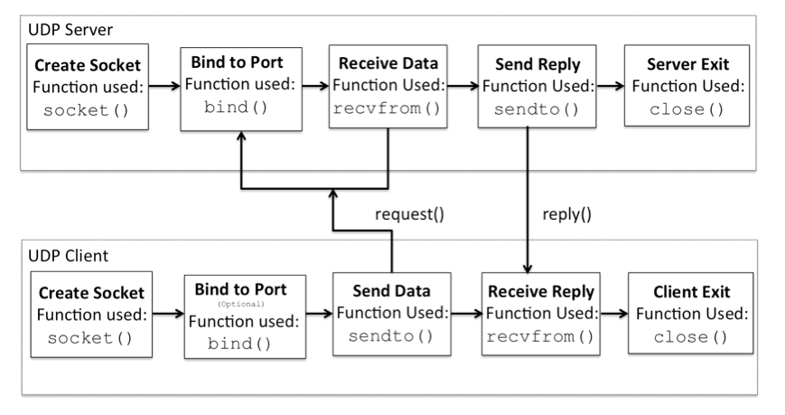

# UDP

UDP（User Datagram Protocol 用户数据报协议）

<details><summary>插图</summary>



</details>

## 1. UDP 服务器

```py
import socket

if __name__ == "__main__":
    # 1. 创建一个 UDP/IP socket
    # 第一个参数为 socket.AF_INET 代表采用 IPv4 协议用于网络通信
    # 第二个参数为 socket.SOCK_DGRAM 代表采用 UDP 协议用于无连接的网络通信
    udp_server_socket = socket.socket(socket.AF_INET, socket.SOCK_DGRAM)

    HOST = ''  # 传入空字符串, 服务器将接受本机所有可用的 IPv4 地址
    PORT = 8000

    # 2. 绑定地址
    udp_server_socket.bind((HOST, PORT))

    # 3. 收发数据
    while True:
        data, addr = udp_server_socket.recvfrom(1024)
        # 接收数据格式为:
        # (b'hello world', ('127.0.0.1', 54158))

        # 将 bytes 对象转换为字符串后打印输出
        print(data.decode())

    # 4. 关闭 socket
    udp_server_socket.close()
```

```py
"""
1. socket.bind(address)

向 socket 绑定 IP 地址与端口

address 参数代表 socket 要绑定的地址
地址族 (Address Family) 为 AF_INET 的 address 格式为 (host, port)

socket 必须未被绑定, 且端口号未被占用, 否则会报错
"""

"""
2. socket.recvfrom(bufsize[, flags])

从远程 socket 接收数据

bufsize 代表 socket 可接收数据的最大字节数
为了使硬件设备与网络传输更好地匹配, bufsize 参数的值最好设置为 2 的幂次方, 例如 4096

返回值为二元组 (bytes, address), \
其中 bytes 是接收到的 bytes 对象数据, \
address 是发送方的地址, 用二元组 (host, port) 表示
"""

"""
3. socket.close()

关闭本地 socket, 释放与该 socket 连接的所有资源
"""
```

使用 with 语句实现

```py
import socket

if __name__ == "__main__":
    HOST = ''
    PORT = 8000

    with socket.socket(socket.AF_INET, socket.SOCK_DGRAM) as s:
        s.bind((HOST, PORT))
        while True:
            data, addr = s.recvfrom(1024)
            print(data.decode())
```

### 编码与解码

```py
"""
1. str.encode(encoding='utf-8', errors='strict')

对字符串进行编码
"""
"""
2. bytes.decode(encoding='utf-8', errors='strict')

对字节串进行解码
"""
```

## 2. UDP 客户端

```py
import socket

if __name__ == "__main__":
    # 1. 创建一个 UDP/IP socket
    udp_client_socket = socket.socket(socket.AF_INET, socket.SOCK_DGRAM)

    HOST = '127.0.0.1'
    PORT = 8000

    data = input('> ')

    # 2. 发送数据
    # 将字符串转换为 bytes 对象后发送
    udp_client_socket.sendto(data.encode(), (HOST, PORT))
    # udp_client_socket.sendto(b'hello world', ('127.0.0.1', 8000))

    # 3. 关闭 socket
    udp_client_socket.close()
```

```py
"""
socket.sendto(data[, flags], address)

向远程 socket 发送数据

远程 socket 的地址在 address 参数中指定, 因此使用前不需要先与远程 socket 连接
地址族 (Address Family) 为 AF_INET 的 address 格式为 (host, port)

返回发送数据的字节数
"""
```

使用 with 语句实现

```py
import socket

if __name__ == "__main__":
    host = '127.0.0.1'
    PORT = 8000

    data = input('> ')

    with socket.socket(socket.AF_INET, socket.SOCK_DGRAM) as s:
        s.sendto(data.encode(), (HOST, PORT))
```

## 3. 端口绑定问题

```py
import socket

if __name__ == "__main__":
    udp_client_socket = socket.socket(socket.AF_INET, socket.SOCK_DGRAM)

    udp_client_socket.bind('', 8050)
    # 若未绑定, 发送数据时使用随机端口号
    # UDP 发送数据可以不绑定, 接收数据必须要绑定

    HOST = '127.0.0.1'
    PORT = 8000

    while True:
        data = input('> ')

        if data == 'exit':
            break

        udp_client_socket.sendto(data.encode(), (HOST, PORT))

    udp_client_socket.close()
```

## 4. UDP 广播

```py
import socket

if __name__ == '__main__':
    # 1. 创建一个 UDP/IP socket
    upd_socket = socket.socket(socket.AF_INET, socket.SOCK_DGRAM)

    # 2. 设置允许发送广播
    upd_socket.setsockopt(socket.SOL_SOCKET, socket.SO_BROADCAST, True)

    # setsockopt(level, option, value)
    # 参数 level 是被设置的选项的级别, \
    # 如果想要在套接字级别上设置选项, 就必须把 level 设置为 SOL_SOCKET
    # 参数 option 指定准备设置的选项
    # SO_BROADCAST, 允许或禁止发送广播数据, \
    # 当 value 不等于 0 时允许, 否则禁止

    # 3. 发送信息
    data = input('> ')
    upd_socket.sendto(data.encode(), ('<broadcast>', 8000))
    # upd_socket.sendto(data.encode(), ('192.168.43.255', 8000))
    # upd_socket.sendto(data.encode(), ('255.255.255.255', 8000))

    # 广播地址 Broadcast Address
    # 在使用 TCP/IP 协议的网络中, 主机标识段 host ID 为全 1 的 IP 地址为广播地址
    # 如 IP 地址 192.168.43.157 的广播地址为 192.168.43.255
    # 或
    # 255.255.255.255

    # 4. 关闭 socket
    upd_socket.close()
```
