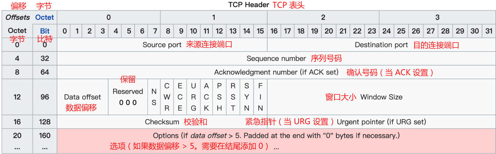
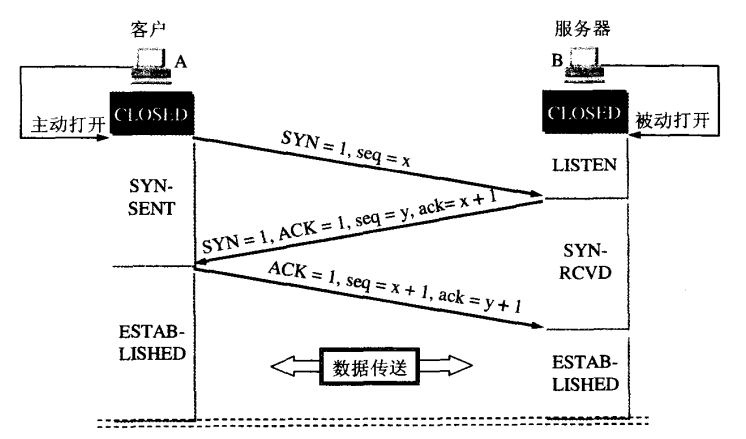
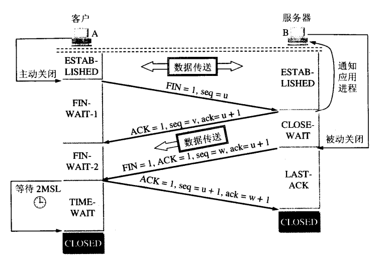
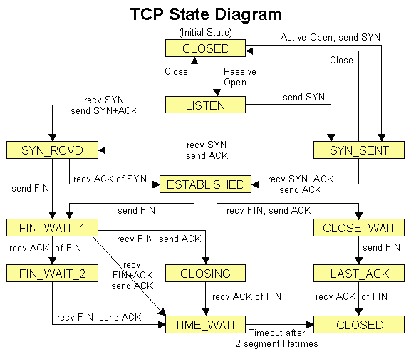
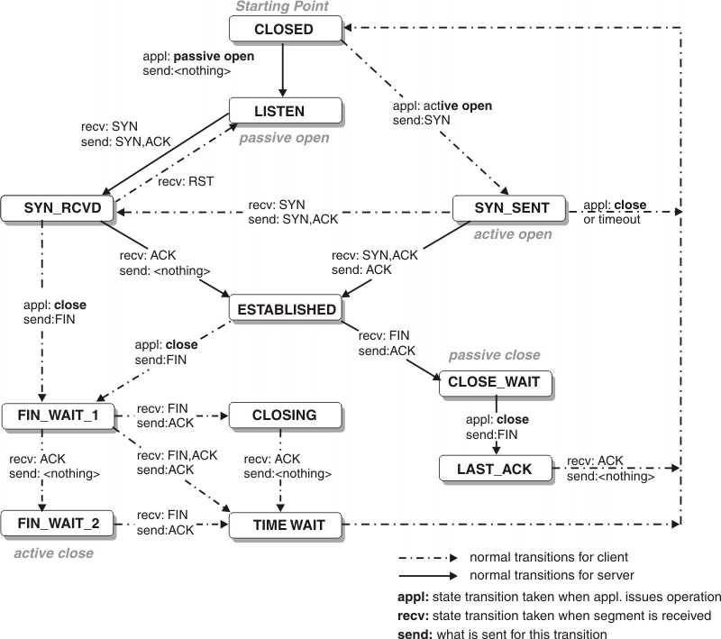

# 有关 TCP 的三次握手和四次挥手

## 1. TCP 表头

TCP 数据报（segment）结构

- 序列号（seq，32 位）Sequence Number
- 确认号（ack，32 位）Acknowledgment Number
- TCP 标志位
  - URG（Urgent）
  - **ACK**（Acknowledgement）- 为 1 表示确认号字段有效
  - PSH（Push）
  - RST（Reset）
  - **SYN**（Synchronize）
  - **FIN**（Finish）- 为 1 表示发送方没有数据要传输了，要求释放连接

## 2. TCP 三次握手

用于建立连接

- **SYN** - 请求建立连接。客户端将标志位 SYN 置为 1，seq=x，并将该报文段（segment）发送给服务器。客户端进入 `SYN_SEND` 状态，表示已经发出连接请求，等待服务器确认应答。
- **SYN-ACK** - 针对客户端的 SYN 的确认应答并请求建立连接。服务器收到客户端的 SYN 报文段后，知道客户端请求建立连接，服务器需对该请求进行确认，将标志位 ACK 置为 1，ack=x+1。同时，服务器还要向客户端请求建立连接，将标志位 SYN 置为 1，seq=y。服务器将上述所有信息放到一个报文段中，一并发送给客户端。服务器进入 `SYN_RECV` 状态。
- **ACK** - 针对服务器端的 SYN 的确认应答。客户端收到服务器的 SYN-ACK 报文段后，检查 ack 是否为 x+1，ACK 是否为 1，若正确则将标志位 ACK 置为 1，ack=y+1，并将该 ACK 报文段发送给服务器。服务器检查 ack 是否为 y+1，ACK 是否为 1，若正确则连接建立成功。客户端和服务器端都进入 `ESTABLISHED` 状态，可以正常传输数据。

## 3. TCP 四次挥手

用于断开连接

由于 TCP 连接是全双工的，因此，每个方向都必须要单独进行关闭，这一原则是当一方完成数据发送任务后，发送一个 FIN 来终止这一方向的连接，收到一个 FIN 只是意味着这一方向上没有数据流动了，即不会再收到数据了，但是在这个 TCP 连接上仍然能够发送数据，直到这一方向也发送了 FIN。首先进行关闭的一方将执行主动关闭，而另一方则执行被动关闭。

- **FIN** - 主动关闭端向对方发送一个 FIN 报文段，表示没有数据要发送了，请求断开连接。发送完毕后，主动关闭端进入 `FIN_WAIT_1` 状态，表示已发送断开连接请求，等待对方确认。
- **ACK** - 被动关闭端收到了对方发来的 FIN 报文段后，向对方回送 ACK 报文段，告诉对方断开连接请求已经收到。回送完毕后，被动关闭端进入 `CLOSE_WAIT` 状态，表示收到对方断开连接请求，已确认应答。主动关闭端收到 ACK 报文段后，进入 `FIN-WAIT-2` 状态，表示收到对方的确认应答，等待对方的断开连接请求。
- **FIN** - 当被动关闭端确认全部数据发送完成之后，则向主动关闭端发送 FIN 报文段，表示没有数据要发送了，请求断开连接。发送完毕后，被动关闭端进入 `LAST_ACK` 状态，表示等待对方的确认应答。
- **ACK** - 主动关闭端收到被动关闭端发送的 FIN 报文段，向对方回送 ACK 报文段。然后主动关闭端进入 `TIME_WAIT` 状态。被动关闭端收到主动关闭端的 ACK 报文段后就断开连接。此时，主动关闭端等待 2MSL（Maximum Segment Lifetime，最大报文段生存时间）后依然没有收到回复，则证明被动关闭端已正常关闭，主动关闭端也关闭连接。

> 为什么要等待 2MSL？
>
> 为了防止这种情况：主动关闭端收到被动关闭端断开连接请求后会回送一个确认信息，但如果该确认信息丢失，即被动关闭端没有收到断开连接请求的确认应答，那么被动关闭端超时后会重发一个断开连接请求，这时主动关闭端还处于 TIME_WAIT 状态，会再次发送一个确认信息。

## 4. TCP 状态

- **LISTEN**（server）- 服务器等待连接请求
- **SYN-SENT**（client）
- **SYN-RECEIVED**（server）
- **ESTABLISHED**（both server and client）- 服务器与客户端的连接已经打开
- **FIN-WAIT-1**（both server and client）
- **FIN-WAIT-2**（both server and client）- 主动关闭端在 FIN-WAIT-1 状态下收到断开连接请求的确认，进入等待对方的断开连接请求的半关闭状态。此时可以接收数据，但不再发送数据
- **CLOSE-WAIT**（both server and client）- 被动关闭端接到对方的 FIN 后，回送 ACK，并进入等待从本地用户发来的断开连接请求的半关闭状态。此时可以发送数据，但不再接收数据
- **CLOSING**（both server and client）
- **LAST-ACK**（both server and client）- 被动关闭端全部数据发送完成之后，向主动关闭端发送 FIN，等待对方断开连接请求的确认
- **TIME-WAIT**(either server or client) - 主动关闭端收到对方的 FIN 后，回送 ACK，等待足够的时间以确保被动关闭端收到断开连接请求的确认
- **CLOSED**（both server and client）- 没有任何连接

