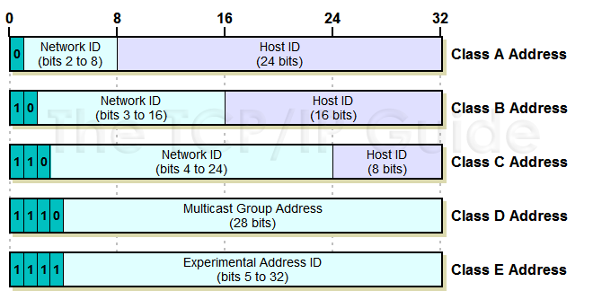

# IP 地址

## IP 地址的概念

IP 地址是指互联网协议地址（Internet Protocol Address，又译为网际协议地址）。IP 地址是 IP 协议提供的一种统一的地址格式。

IP 地址用来在网络中标记一台电脑，是网络设备为网络中的每台计算机分配的一个唯一标识。比如 `192.168.1.1` 在本地局域网上是唯一的。

## IP 地址的分类

生活中我们说的 IP 地址通常指的是 IPv4（IP 协议的第 4 个版本）。

每一个 IP 地址包括两部分：**网络号** 和 **主机号**。



### A 类

- 由 1 字节网络号和 3 字节主机号组成
- 最高位为 `0`，开始地址为 `0.0.0.0`，结束地址为 `127.255.255.255`

### B 类

- 由 2 字节网络号和 2 字节主机号组成
- 最高位为 `10`，开始地址为 `128.0.0.0`，结束地址为 `191.255.255.255`

### C 类

- 由 3 字节网络号和 1 字节主机号组成
- 最高位为 `110`，开始地址为 `192.0.0.0`，结束地址为 `223.255.255.255`

### D 类

- 最高位为 `1110`，开始地址为 `224.0.0.0`，结束地址为 `239.255.255.255`
- 用于组播

### E 类

- 最高位为 `1111`，开始地址为 `240.0.0.0`，结束地址为 `255.255.255.255`
- 为将来使用保留，仅作实验和开发用

### 私有 IP 地址

无法直接访问互联网，在局域网中使用。

- A 类地址 - `10.0.0.0` ~ `10.255.255.255`
- B 类地址 - `172.16.0.0` ~ `172.31.255.255`
- C 类地址 - `192.168.0.0` ~ `192.168.255.255`

### 注意

IP 地址 `127.0.0.1` ~ `127.255.255.255` 用于回路测试。

回送地址 `127.0.0.1` 等效于 `localhost` 或本机 IP 地址，一般用于测试使用。例如 `ping 127.0.0.1` 来测试本机 TCP/IP 是否正常。

## 查看 IP 地址

Linux 下的 `ifconfig` 命令可以查看电脑的 IP 地址信息，而 Windows 下则为 `ipconfig`。

```sh
$ ifconfig

# 禁用 ens40 网卡
$ sudo ifconfig ens40 down
# 启用 ens40 网卡
$ sudo ifconfig ens40 up
# 小技巧 Ctrl+A 将光标移动到命令行开头
```
