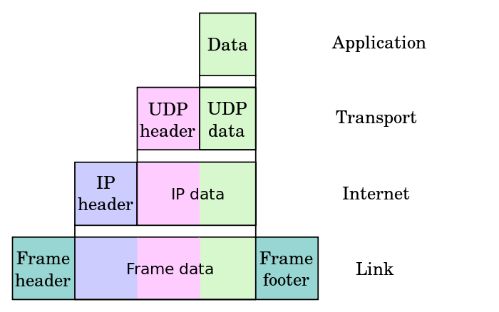
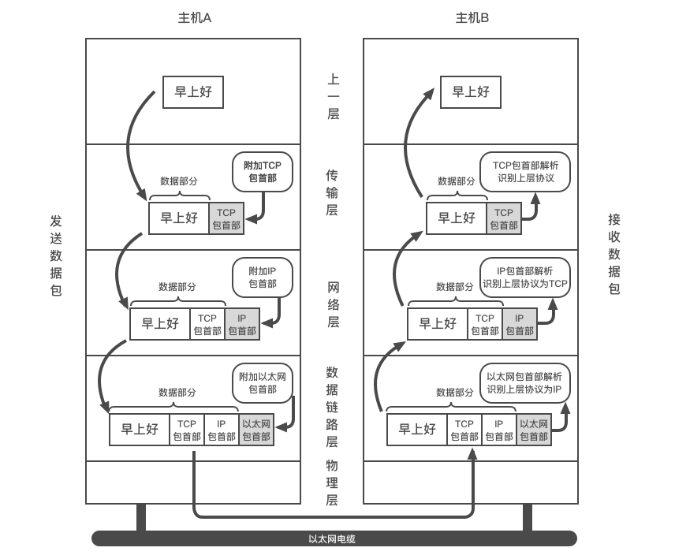

# TCP/IP 协议

OSI 模型（七层）

- 应用层（Application layer）
- 表示层（Presentation layer）
- 会话层（Session layer）
- 传输层（Transport layer）
- 网络层（Network layer）
- 数据链路层（Data Link layer）
- 物理层（Physical layer）

TCP/IP 模型（四层）

- 应用层（Application layer）- `HTTP` `SMTP` `FTP` `DNS`
- 传输层（Transport layer）- `TCP` `UDP`
- 网际层（Internet layer）- `IP`
- 链路层（Link layer）也叫网络接口层

沿着不同的层应用数据的封装递减

数据处理流程

